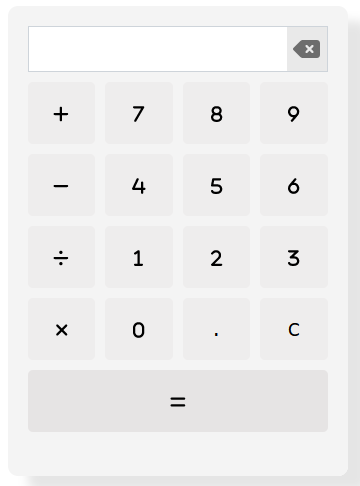
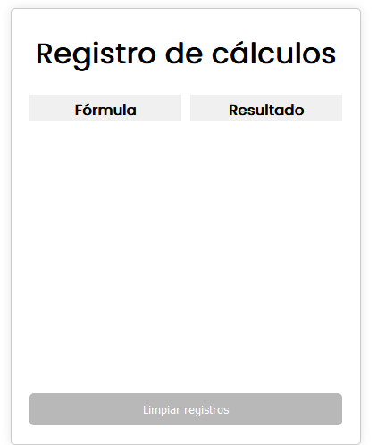
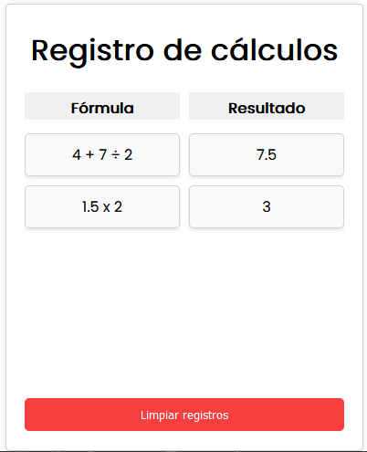
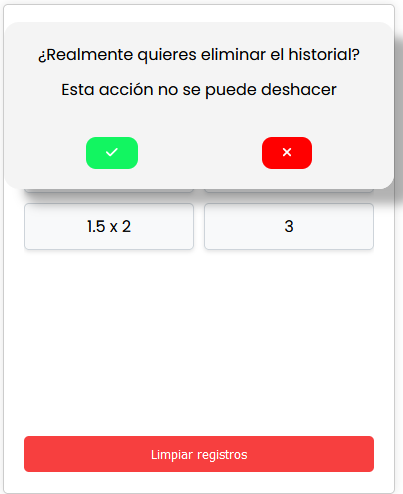

<div style="display: flex; align-items: center; gap: 10px;">
  <h1>Calculadora creada con React</h1>
  
</div>

Una simple calculadora desarrollada en React para realizar operaciones matemáticas básicas.

## Funcionalidades

- Suma, resta, multiplicación y división de números.
- Botón de igual (=) para mostrar el resultado de la operación.
- Botón de borrar (C) para limpiar la pantalla.
- Operaciones con decimales soportadas.

## Capturas de pantalla

| Descripción | Imagen |
|-------------|--------|
| **Calculadora** <br> La calculadora es la herramienta principal de la aplicación. Permite realizar operaciones matemáticas básicas como suma, resta, multiplicación y división. |  |
| **Registro con cálculos** <br> Cuando la calculadora no tiene ningún cálculo registrado, el registro aparece vacío, listo para almacenar nuevos resultados. |  |
| **Registro vacío** <br> En esta captura de pantalla se muestra el registro de cálculos de la calculadora, donde se pueden ver los resultados de las operaciones realizadas previamente. |  |
| **Pantalla de confirmación para vaciar el registro** <br> Para evitar borrar accidentalmente los cálculos registrados, la aplicación muestra una pantalla de confirmación al intentar vaciar el registro. |  |

## Demo

Puedes probar esta calculadora en vivo presionando [este enlace](https://juanblancodev.github.io/react-calculator/)

## Clonar el proyecto

Si quieres clonar este proyecto en tu máquina local, sigue estos pasos:

1. Abre tu terminal.
2. Navega hasta la carpeta donde quieras clonar el proyecto.
3. Ejecuta el siguiente comando para clonar el repositorio:

   ```bash
   git clone https://github.com/JuanBlancodev/react-calculator.git
   ```
4. Una vez hayas clonado el proyecto, ingresa a la carpeta con:

   ```bash
   cd react-calculator
   ```
5. Instala las dependencias del proyecto ejecutando uno de los siguientes comandos, dependiendo de tu gestor de paquetes:

   ```bash
   npm install
   ```
   o
   ```bash
   yarn install
   ```
   
## Tecnologías utilizadas

<ul>
  <li style="display: flex; align-items: center; gap: 10px;">
     <b>HTML</b>
  </li>
  <li style="display: flex; align-items: center; gap: 10px;">
     <b>CSS</b>
  </li>
  <li style="display: flex; align-items: center; gap: 10px;">
     <b>React</b>
  </li>
</ul>

## Autor

- **Nombre**
  _Juan Blanco_
- **GitHub**
  [@JuanBlancodev](https://github.com/JuanBlancodev)
